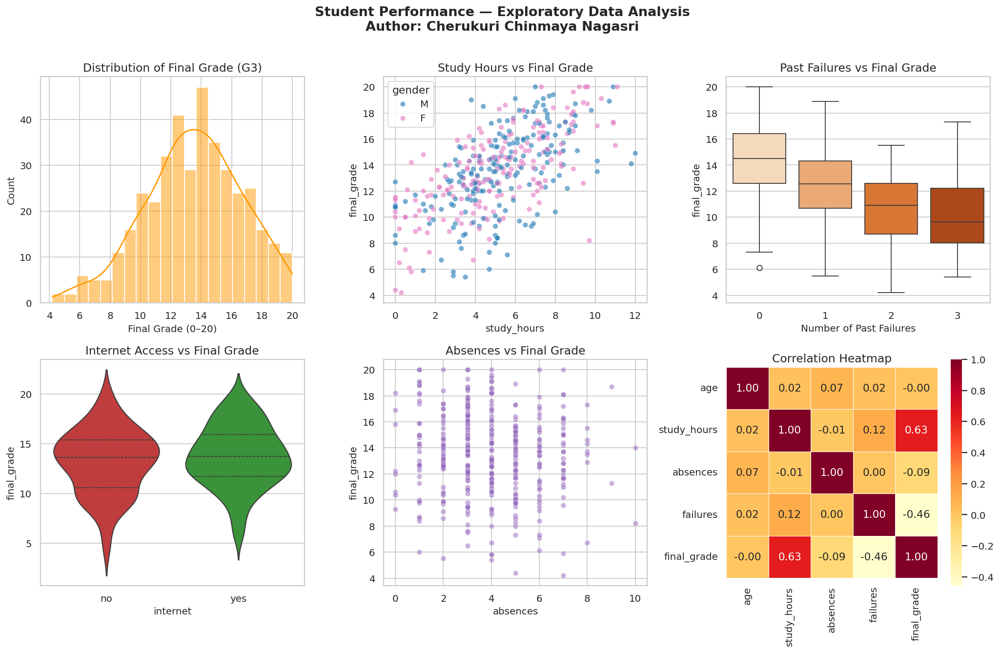
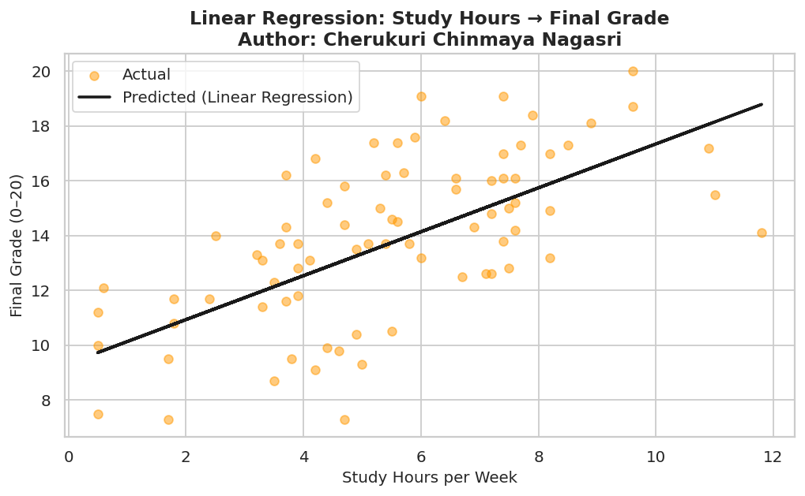

# Student Performance Analysis — EDA & Linear Regression

**Author:** Cherukuri Chinmaya Nagasri  
**Domain:** Data Science / Machine Learning  
**Tools:** Python, Pandas, Matplotlib, Seaborn, Scikit-learn

---

## Objective

Analyse factors that affect student academic performance using Exploratory Data Analysis (EDA) and a Linear Regression model to predict final grades.

---

## Dataset

Inspired by the **UCI Student Performance Dataset** (395 students, 9 features):

| Feature | Description |
|---|---|
| `age` | Student age (15–21) |
| `study_hours` | Weekly study hours |
| `absences` | Number of school absences |
| `failures` | Number of past class failures |
| `internet` | Internet access at home (yes/no) |
| `extra_support` | Extra educational support (yes/no) |
| `parent_edu` | Parent education level |
| `gender` | Student gender |
| `final_grade` | Final grade out of 20 (target variable) |

---

## Key Findings

| Insight | Value |
|---|---|
| Study Hours vs Final Grade (correlation) | +0.625 (strong positive) |
| Failures vs Final Grade (correlation) | -0.458 (strong negative) |
| Students with internet access score on avg | +0.54 points higher |
| Linear Regression R² Score | 0.386 |

---

## Visualisations

### EDA Dashboard


### Linear Regression: Study Hours → Final Grade


---

## How to Run

```bash
# Clone the repo
git clone https://github.com/chcnagasri-tech/student-performance-analysis.git
cd student-performance-analysis

# Install dependencies
pip install pandas numpy matplotlib seaborn scikit-learn

# Run the analysis
python student_performance_analysis.py
```

---

## Concepts Applied

- Exploratory Data Analysis (EDA)
- Correlation Analysis
- Data Visualisation (Histogram, Boxplot, Violin Plot, Scatter Plot, Heatmap)
- Linear Regression (Scikit-learn)
- Train/Test Split & Model Evaluation (R², RMSE)
